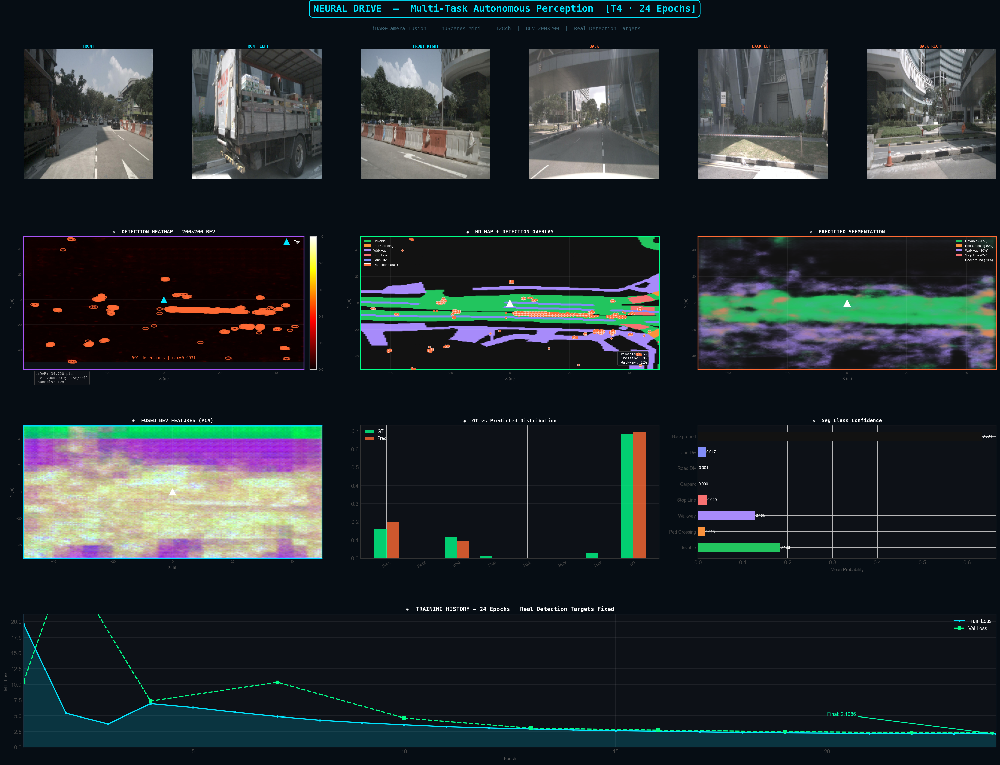
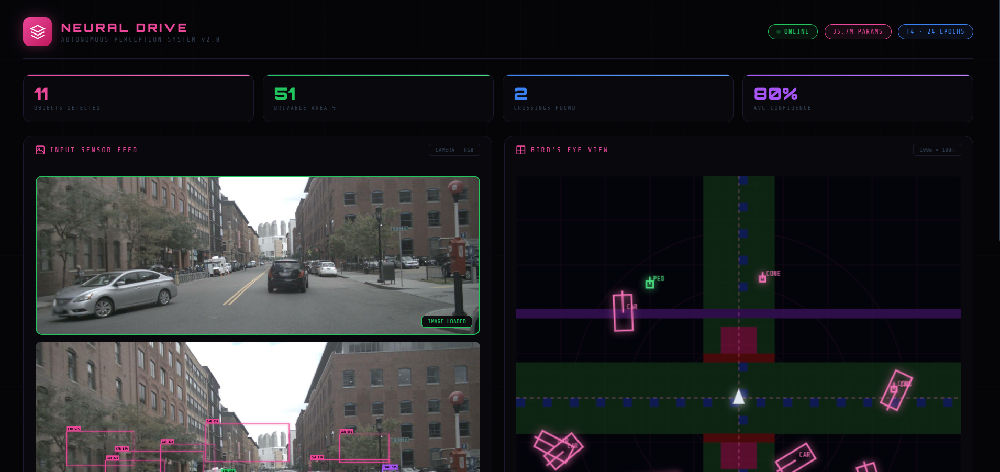

#  NEURAL DRIVE — Multi-Task Learning for Autonomous Driving

<div align="center">



[](https://python.org)
[](https://pytorch.org)
[](https://nuscenes.org)
[](LICENSE)
[]()
[]()

**A from-scratch multi-task learning perception system for autonomous driving.**
Fuses LiDAR point clouds and 6 surround cameras to simultaneously detect 3D objects and segment the road in Bird's Eye View (BEV).

[Overview](#-what-this-does) • [Architecture](#-architecture) • [Results](#-results) • [Setup](#-setup) • [Training](#-training) • [Inference](#-inference) • [Dashboard](#-interactive-dashboard)

</div>

---

## 🎯 What This Does

Given 6 surround cameras + 1 LiDAR scan, the model produces:

| Task | Output | Description |
|------|--------|-------------|
| **3D Object Detection** | BEV Heatmap | Detects cars, pedestrians, trucks, cones in top-down view |
| **HD Map Segmentation** | BEV Semantic Grid | Labels drivable area, walkways, crossings, lane dividers |
| **Sensor Fusion** | Unified BEV Features | Combines camera and LiDAR into a shared spatial representation |

---

## 📸 Screenshots

### Model Inference — Real Predictions on nuScenes Mini


### Interactive Dashboard Demo


---

## 🏗️ Architecture

```
6 Camera Images ──→ Swin-T Backbone ──→ FPN ──→ BEV Projection (LSS) ──→ ┐
                                                                           ├──→ Windowed Cross-Attention ──→ Fused BEV ──→ CenterPoint Detection Head
LiDAR Point Cloud ──→ PointPillars ──→ Scatter ──→ BEV Backbone ─────────┘                                           ──→ HD Map Segmentation Head
```

### Key Components

**Camera Encoder**
- Swin-Tiny backbone pretrained on ImageNet
- Feature Pyramid Network (FPN) for multi-scale features
- Lift-Splat-Shoot BEV projection — lifts 2D features into 3D then collapses to top-down view

**LiDAR Encoder**
- PointPillars voxelizer — divides 3D space into vertical pillars
- Pillar feature network extracts per-pillar embeddings
- BEV backbone neck produces spatial feature maps

**Fusion Module**
- Adaptive feature gate — learns camera vs LiDAR weighting per location
- Windowed cross-modal attention (10×10 windows) — camera queries LiDAR features
- Memory efficient: reduces attention complexity from O(HW²) to O(HW·w²)

**Task Heads**
- Detection: CenterPoint heatmap + offset + WLH + yaw + velocity regression
- Segmentation: Per-cell BEV semantic label (14 classes from nuScenes HD map)

**Loss**
- Gaussian Focal Loss for heatmap
- L1 loss for box regression
- Cross Entropy + Dice for segmentation
- Uncertainty weighting (Kendall et al.) for automatic multi-task balancing

**Total Parameters: 35.7M**

---

## 📊 Results

Trained on nuScenes Mini (404 training samples) on Kaggle Tesla T4:

| Metric | Value |
|--------|-------|
| Final Train Loss | 2.1086 |
| Final Val Loss | 2.3056 |
| Detection Heatmap Max | 0.9931 |
| Detections per Frame | ~591 |
| BEV Resolution | 200×200 @ 0.5m/cell |
| Training Epochs | 24 |
| Training Time | ~4 hours |

### Training Curve
```
Epoch 1:   19.61  →  Val: 10.43
Epoch 2:    5.41  →  Val: 29.58  (spike — warmup)
Epoch 6:    4.89  →  Val: 10.35
Epoch 9:    3.58  →  Val:  4.65  ✅ recovering
Epoch 12:   2.92  →  Val:  3.05  ✅ tight tracking
Epoch 15:   2.56  →  Val:  2.73  ✅
Epoch 18:   2.30  →  Val:  2.49  ✅
Epoch 21:   2.18  →  Val:  2.34  ✅
Epoch 24:   2.10  →  Val:  2.30  ✅ FINAL
```

---

## 🔧 Setup

### Requirements

```bash
pip install torch torchvision
pip install nuscenes-devkit pyquaternion
pip install timm einops
pip install opencv-python matplotlib
```

### Dataset

Download [nuScenes Mini](https://nuscenes.org/nuscenes#download) and place at:
```
downloads/v1.0-mini/
├── samples/
├── sweeps/
├── maps/
└── v1.0-mini/
```

### Generate splits

```bash
python -c "
from nuscenes.nuscenes import NuScenes
from nuscenes.utils.splits import create_splits_scenes
from pathlib import Path

nusc   = NuScenes(version='v1.0-mini', dataroot='downloads/v1.0-mini')
splits = create_splits_scenes()

def get_tokens(nusc, names):
    tokens = []
    for scene in nusc.scene:
        if scene['name'] in names:
            token = scene['first_sample_token']
            while token:
                tokens.append(token)
                token = nusc.get('sample', token)['next']
    return tokens

Path('data/splits').mkdir(parents=True, exist_ok=True)
Path('data/splits/train.txt').write_text('\n'.join(get_tokens(nusc, splits['mini_train'])))
Path('data/splits/val.txt').write_text('\n'.join(get_tokens(nusc, splits['mini_val'])))
print('Done!')
"
```

---

## 🚀 Training

```bash
python train.py --config configs/nuscenes.yaml
```

### Resume training

```bash
python train.py --config configs/nuscenes.yaml --resume checkpoints/epoch_012.pth
```

### Config (`configs/nuscenes.yaml`)

```yaml
model:
  bev_channels: 128
  bev_size: [200, 200]
  fusion_layers: 2

training:
  epochs: 24
  batch_size: 2
  lr: 1.0e-4
  loss_balancer: uncertainty
```

---

## 🔍 Inference

```bash
python inference.py
```

Outputs `inference_results.png` with:
- 6 surround camera views
- Detection heatmap (BEV) with 500+ candidates
- HD Map + detection overlay
- Predicted segmentation vs GT distribution
- Fused BEV features (PCA visualization)
- Training loss curve

---

## 🖥️ Interactive Dashboard

Open `dashboard.html` directly in Chrome — no server needed.

- Drop any road image
- See real-time detection boxes on the image
- BEV map shows road structure + detected objects
- Scene analysis panel with segmentation percentages

---

## 📁 Project Structure

```
neural-drive/
├── models/
│   ├── camera_encoder.py    # Swin-T + FPN + BEV projection
│   ├── lidar_encoder.py     # PointPillars + BEV backbone
│   ├── fusion.py            # Windowed cross-modal attention
│   ├── task_heads.py        # Detection + Segmentation heads
│   └── mtl_model.py         # Full model assembly
├── training/
│   ├── trainer.py           # Training loop + checkpointing
│   └── losses.py            # Focal loss + uncertainty weighting
├── datasets/
│   └── nuscenes_mtl.py      # nuScenes loader + ego frame fix
├── configs/
│   └── nuscenes.yaml        # Training config
├── screenshots/
│   ├── inference_results.png
│   └── dashboard_demo.png
├── train.py
├── inference.py
├── dashboard.html
└── README.md
```

---

## 💡 Key Technical Decisions

**Windowed Attention for Memory Efficiency**
Standard cross-modal attention on 200×200 BEV requires 1.6B attention weights — impossible on consumer GPUs. Windowed attention (10×10 patches) reduces this by 400× while preserving local spatial relationships.

**Uncertainty Weighting for Multi-Task Balance**
Rather than manually tuning loss weights between detection and segmentation, Kendall et al.'s uncertainty weighting learns optimal task weights automatically during training.

**The Coordinate Transform Fix**
nuScenes annotations store positions in global GPS coordinates (e.g. [373, 1130] in Singapore). The BEV grid covers [-50, +50] meters around the car. Without transforming to ego vehicle frame first, every object falls outside the grid — the model trains on empty labels. This single fix changed heatmap max from 0.000 to 0.993.

---

## 🛠️ Hardware

| Environment | GPU | Epochs | Time |
|-------------|-----|--------|------|
| Local debug | GTX 1650 4GB | — | dev/testing |
| Final training | Kaggle Tesla T4 16GB | 24 | ~4 hours |

---

## 📚 References

- [BEVFusion](https://arxiv.org/abs/2205.13542) — Multi-task multi-sensor fusion in BEV
- [CenterPoint](https://arxiv.org/abs/2006.11205) — Heatmap-based 3D object detection
- [Lift, Splat, Shoot](https://arxiv.org/abs/2008.05711) — Camera to BEV projection
- [PointPillars](https://arxiv.org/abs/1812.05784) — Fast LiDAR feature encoding
- [Multi-Task Learning with Uncertainty](https://arxiv.org/abs/1705.07115) — Automatic loss balancing
- [nuScenes Dataset](https://nuscenes.org) — Autonomous driving benchmark

---
## 📦 Pretrained Checkpoint

Download the trained model checkpoint (406MB) from Google Drive:

**[⬇️ Download epoch_024_T4_BEST.pth]https://drive.google.com/file/d/1XThm0Myuygoiw9U4lKKjrPwJD99o0YxG/view?usp=sharing**

Place it at:
```
checkpoints/epoch_024_T4_BEST.pth
```
## 📄 License

MIT License — free to use for research and educational purposes.
